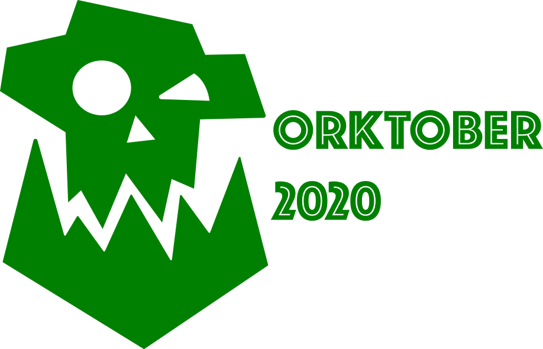

## Orktober 2020

Several game companies (notably those focused on GrimDark settings) have coined the term ["Orktober"](https://www.kromlech.eu/EN-H5/1/422/orktober.html) as a celebration for the month of October.

Most of these are based around buying stuff.

I'm planning on celebrating Orktober this year, but in a different way. I'm going to 3D print and paint an entire Ork warband for [Warhammer 40k](https://www.games-workshop.com/en-US/Warhammer-40-000), using 3D models from [GearGutz's Mekshop](https://geargutsmekshop.com).

There are multiple components to this project:

1. I want to see if I can build a full army in a single month. That's a big stretch.
2. I want to document the process.
3. I want to build at GearGutz 100% size. To date I've been building at 85%, which more closely matches GW scale.
4. I want to understand GitKraken's GloBoards a little better, and so I've set up a full KanBan board for this project.
5. I want to explore project pages in GitHub.

The only rules I've set up for myself are:

1. Try not to buy anything new (apart from printer filament)
2. All printing and painting must begin no sooner than Orktober 1.
3. Bases are the exception to rule 2.

Software I'll be using (apart from camera/photo tools):

- the [atom](https://atom.io) text editor
- [GitHub Pages](https://pages.github.com)
- GitKraken [GloBoards](https://www.gitkraken.com/boards)
- [Ultimaker Cura](https://ultimaker.com/software/ultimaker-cura)
